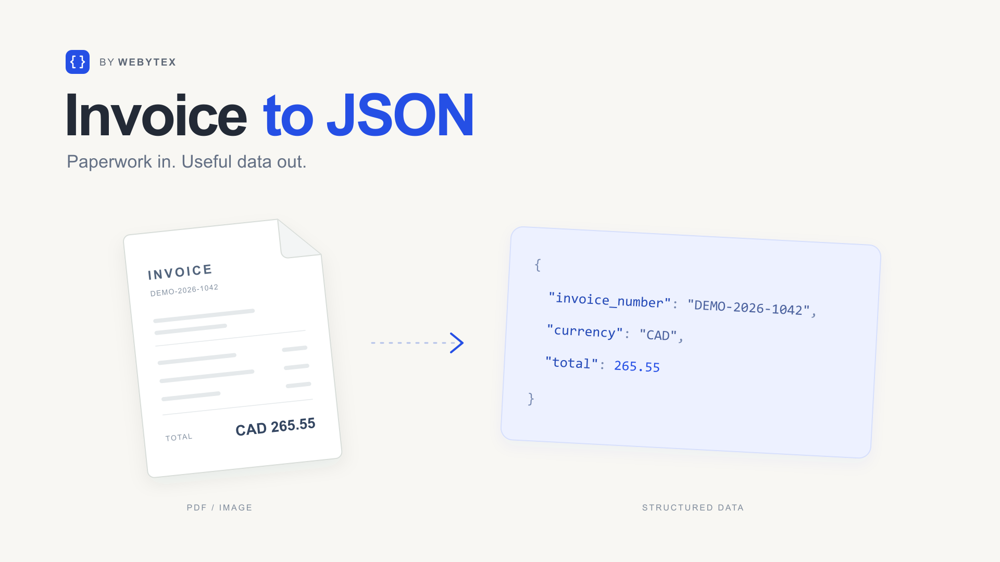

# Invoice to JSON

Turn one invoice PDF or image into structured JSON, with explicit review checks and source previews. A small open-source project by [Martin Poli / Webytex](https://webytex.com/).

[Demo](https://webytex-invoice-to-json.vercel.app) · [Source](https://github.com/mspoli96-dev/invoice-to-json) · [Discuss a workflow](https://business.webytex.com/#quick-contact)



**Release status, October 3, 2026:** the demo is live on Vercel. Type checking, 34 tests, and the production build passed. A real browser upload completed through BotID and OpenAI, preserving the missing currency for review. The hosted rate limit and rejection of requests without browser verification were also checked. [GitHub Actions](https://github.com/mspoli96-dev/invoice-to-json/actions) records verification for each published revision.

## What it does

- Preview one invoice PDF, PNG, or JPEG and inspect structured fields or JSON.
- Flag missing values and arithmetic inconsistencies without silently correcting the source.
- Copy or download the invoice JSON.
- Explore three clearly labelled synthetic samples without credentials or a model request.
- Use a separate, configurable live extraction path with GPT-5.6 Sol and high reasoning.

The samples cover a CAD invoice, an unresolved currency, and an incorrect printed total. They return prepared fixtures. Live extraction processes an uploaded document through OpenAI. Neither a matching total nor valid JSON establishes that every field was read correctly.

## Run locally

Use Node.js 24.x and npm:

```bash
npm ci
npm run dev
```

Open [http://127.0.0.1:3000](http://127.0.0.1:3000). Sample mode works without an API key. To verify or run the production build:

```bash
npm run typecheck
npm test
npm run build
npm run start
```

GitHub Actions uses the same install, type-check, test, and build commands. See [validation](docs/VALIDATION.md) for recorded results and their limits.

## Configure live extraction

Copy `.env.example` to `.env.local` using your shell, then configure only the values needed for your environment. Keep credentials server-side and out of source control.

| Variable | Default | Purpose |
| --- | --- | --- |
| `LIVE_EXTRACTION_ENABLED` | `false` | Explicit switch for real extraction |
| `OPENAI_API_KEY` | Empty | Secret key for your authorized, funded API project |
| `OPENAI_PROJECT_HARD_LIMIT_CONFIRMED` | `false` | Operator confirmation that the provider spending control has been configured and checked |
| `APP_ORIGIN` | Empty | Exact HTTPS origin for hosted use, without a trailing slash |
| `VERCEL_BOTID_ENABLED` | `false` | Operator confirmation that hosted BotID protection is configured |
| `VERCEL_RATE_LIMIT_CONFIRMED` | `false` | Operator confirmation that external rate limiting is configured |
| `NEXT_PUBLIC_REPOSITORY_URL` | Empty | Public source link shown by the interface; contains no secret |
| `NEXT_PUBLIC_SITE_URL` | Empty | Public base URL for social-sharing metadata; local fallback is `http://localhost:3000` |

Local development needs the live switch, key, and spending-control confirmation. Hosted use, including `NODE_ENV=production`, additionally requires the exact HTTPS origin and BotID/rate-limit confirmations. These flags do not configure or verify a provider. There is no application-wide daily quota in this repository.

The public deployment limits `POST /api/extract` to three requests per 60 seconds per IP address in each region. Its fourth and fifth requests were observed returning HTTP 429 during the release check. This regional request limit is not a global spending cap.

## Architecture and limits

Next.js, React, and TypeScript provide the interface. The server validates file signatures and contents with `pdf-lib` and `sharp`, performs an input-token preflight, requests a structured response through the OpenAI Responses API, validates it with Zod, and runs deterministic invoice checks. Vercel BotID Basic protects the hosted live route when configured; the handler rejects malformed verification results rather than accepting an ambiguous response.

The [invoice contract](src/lib/contracts.ts) includes dates, parties, currency, line items, taxes, totals, and notes. Missing scalar values use `null`. A bare dollar sign does not establish CAD or USD. Tax rates use percentage units: `13` means 13%.

| Limit | Value |
| --- | --- |
| File | One PDF, PNG, or JPEG; at most 4,000,000 bytes |
| PDF | 1 or 2 unlocked, parseable pages |
| Image | Still image, at most 20 megapixels and 10,000 pixels per side |
| Model input / output | 20,000 / 8,000 tokens |
| Invoice rows | At most 60 line items and 10 tax lines |
| Provider calls | No automatic retries; bounded count and extraction timeouts |

Live mode sends document content to OpenAI for counting and extraction. The adapter uses `store: false` and no model tools; this is not a zero-retention guarantee. Only upload documents you may share. The app does not approve invoices, make payments, or connect to accounting systems.

## Evaluation

On October 3, 2026, the final live evaluation matched all 66 compared top-level fields across six synthetic fixtures: three invoices, each represented as a PDF and PNG. Notes were excluded and arrays compared in source order.

The final pass estimated **USD 0.113707 in model usage**. Measured durations ranged from **3.115 to 4.259 seconds**, averaging **3.722 seconds**, including token preflight and generation but excluding browser upload. An earlier two-request pass exposed a tax-label ambiguity; the prompt/schema were clarified before the final pass. All eight evaluation requests together estimated USD 0.151056.

These are model-cost estimates, not a provider invoice. They exclude hosting and any separate charge for token counting. This small, synthetic dataset was also used during refinement, so it is not an independent accuracy benchmark or a production performance guarantee. [Method and results](docs/VALIDATION.md)

To regenerate synthetic PDFs and expected JSON:

```bash
npm run samples
```

Add `-- --render` to regenerate PNGs with Poppler's `pdftoppm` installed. To inspect the evaluation instructions without API calls:

```bash
npm run evaluate
```

To run the six paid cases deliberately:

```bash
npm run evaluate -- --run-paid-evaluation
```

The paid script reads `OPENAI_API_KEY` and `OPENAI_PROJECT_HARD_LIMIT_CONFIRMED` from the process environment. It does not automatically load `.env.local`. It limits requests and reserves model cost before each case, stops on a failure without retrying, and retains results under the ignored `.local/evaluations/` directory. Failed requests may still incur charges.

Pricing assumptions are dated and expire after November 21, 2026. Recheck [official model documentation](https://developers.openai.com/api/docs/models/gpt-5.6-sol) before updating them. The [build log](docs/BUILD-LOG.md) separates implementation, verification, and release events.

## Work with Martin

Need a document workflow connected to the tools your team already uses? I can help define the review rules and build the integration in accounts your business controls.

[Discuss your workflow](https://business.webytex.com/#quick-contact) · [hello@webytex.com](mailto:hello@webytex.com)

## License

[MIT](LICENSE), copyright 2026 Martin Poli. Original code and synthetic fixtures are provided for inspection and reuse. Third-party dependencies retain their own licenses. AI assisted implementation, tests, and documentation; no client code or documents are included.
